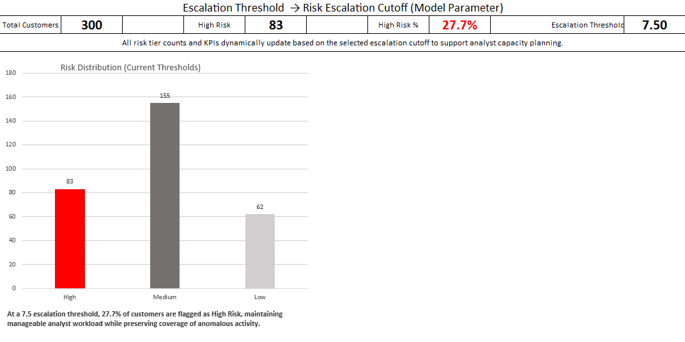
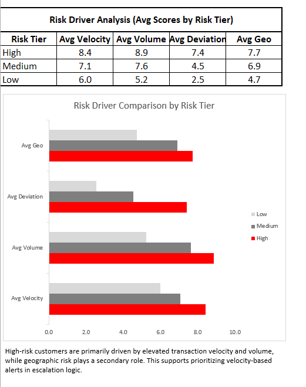

# Risk Scoring & Operational Analytics (Case 2)

## Case Snapshot 

**Domain:** Fraud Risk / Financial Crime Analytics  
**Tools:** Excel (advanced formulas, structured tables, dashboards, scenario testing)  
**Focus:** Risk scoring, escalation thresholds, analyst workload optimization  

**What this case demonstrates:**
- Built a composite customer risk scoring model using multiple behavioral risk drivers
- Classified customers into Low / Medium / High risk tiers
- Tested escalation thresholds to balance fraud detection with analyst capacity
- Translated model outputs into operational dashboards for decision support

---

## Objective

Design a practical risk scoring framework that supports real-world fraud escalation decisions, not just theoretical scoring. The goal is to show how risk models can be tuned to control alert volume while maintaining sufficient coverage of high-risk behavior.

---

## Risk Scoring Framework

Each customer receives a **Final Risk Score** derived from four key drivers:

- **Velocity Score** — abnormal transaction frequency patterns  
- **Volume Score** — unusually high transaction amounts  
- **Deviation Score** — deviation from historical customer behavior  
- **Geographic Risk Score** — exposure to higher-risk jurisdictions  

These drivers are normalized and combined into a composite score, enabling consistent comparison across customers.

Customers are then classified into:
- **High Risk**
- **Medium Risk**
- **Low Risk**

based on an adjustable escalation threshold.

---

## Threshold Sensitivity & Escalation Logic

Rather than hard-coding risk tiers, this case introduces a **dynamic escalation threshold**:

- The escalation cutoff can be adjusted to simulate policy changes
- Risk tier counts update automatically as the threshold changes
- This allows evaluation of trade-offs between:
  - Fraud detection coverage
  - Analyst workload and alert volume

This mirrors how real compliance and fraud teams tune thresholds over time.

---

## Dashboard Overview

The dashboard translates model outputs into **operationally meaningful metrics**, including:

- Total customers analyzed
- High-risk customer count and percentage
- Current escalation threshold
- Risk distribution across tiers
- Average risk driver contribution by risk tier

These visuals are designed for **risk managers and analysts**, not data scientists.

**Screenshots:**
- 
- 

---

## Key Insights

- At an escalation threshold of **7.5**, **27.7%** of customers are classified as High Risk
- High-risk customers show significantly higher **transaction velocity and volume**
- Behavioral deviation is a strong secondary driver
- Geographic risk contributes meaningfully but is not the primary escalation trigger

This confirms that escalation decisions are primarily driven by **behavioral anomalies**, not geography alone.

---

## Why This Matters

In real fraud and AML operations, risk models must do more than score customers — they must support **escalation policy, analyst capacity planning, and governance decisions**.

This case demonstrates how analytical outputs can be translated into **practical operational controls**, aligning risk detection with business constraints.

---

## Deliverables

- **Case2_Risk_Scoring.xlsx** — full scoring model, threshold testing, and dashboard
- **Dashboard Overview** — risk distribution and escalation metrics
- **Risk Driver Analysis** — average driver contribution by risk tier

---

## Portfolio Context

This case focuses on **risk scoring and operational decision support**, complementing:
- Case 1: Transaction investigation and alert review
- Case 3: KYC compliance and control operations

Together, these cases represent the **end-to-end financial crime analytics lifecycle**.
